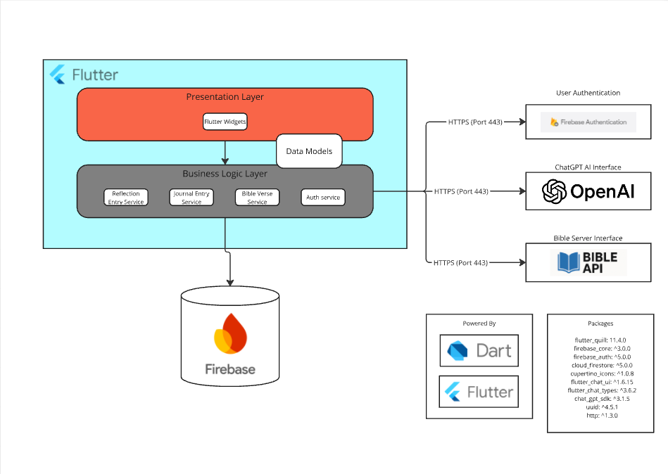
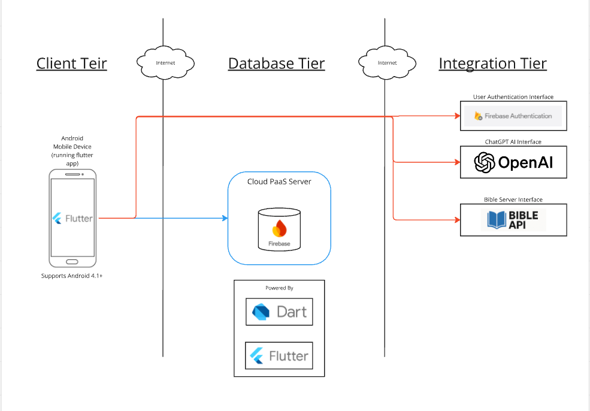

# Bible Journaling App - Senior Project Portfolio

## Project Overview
The Bible Journaling App is a mobile application developed using Flutter and Firebase to provide users with a personalized and secure platform for journaling their Bible study and reflections. The app allows users to create and manage journal entries, tag them for easy organization, pin Bible verses to their dashboard, and access AI-generated reflection prompts based on selected scripture. This project was completed as part of CST-451 and CST-452 Senior Project courses.

## Background
During the early stages of the project, a need was identified for a modern Bible study tool that went beyond basic Bible reading apps. Many existing solutions lacked deep journaling functionality tied to scripture. The goal of this project was to create an accessible, visually appealing, and spiritually enriching tool that encourages users to engage actively with the Bible through reflection, writing, and study. Key non-functional requirements focused on security, responsiveness, and ease of use to ensure that user data remains private and the app functions smoothly across Android devices.

## Design Diagrams

### System Architecture Diagram


### Database Design Diagram


---

## Code Snippets

### Creating a New Journal Entry
```dart
void createJournalEntry(String title, String content, List<String> tags) {
  final newEntry = {
    'title': title,
    'content': content,
    'tags': tags,
    'timestamp': DateTime.now(),
  };
  FirebaseFirestore.instance.collection('journalEntries').add(newEntry);
}
```

### Pinning a Bible Verse to the Dashboard
```dart
void pinVerse(String verseId) async {
  final user = FirebaseAuth.instance.currentUser;
  await FirebaseFirestore.instance
      .collection('users')
      .doc(user!.uid)
      .update({'pinnedVerseId': verseId});
}
```

### Searching Journal Entries by Tag
```dart
Stream<QuerySnapshot> searchEntriesByTag(String tag) {
  return FirebaseFirestore.instance
      .collection('journalEntries')
      .where('tags', arrayContains: tag)
      .snapshots();
}
```

---

## Approach to Implementation
The project was built following a modular, incremental development approach:
- **Planning**: Requirements were defined, and design diagrams were created to guide implementation.
- **Technologies Chosen**: Flutter was used for cross-platform mobile development, Firebase for authentication and data storage, API.Bible for scripture integration, and OpenAI API for generating reflection prompts.
- **Development**: Features were implemented iteratively. Key features like journal entry creation, verse pinning, and tag management were prioritized first.
- **Testing**: Manual testing and user feedback were used to refine the app. Test cases were created for all major features.
- **Security Focus**: Firebase Authentication was implemented to ensure that user data is secured. Firestore security rules protect journal entries and user information.
- **UI/UX Design**: Special care was taken to ensure a clean, intuitive interface with simple navigation, responsive layouts, and appealing visual elements.

---

## How to Run / Access the Project

1. Clone the repository:
    ```bash
    git clone https://github.com/yourusername/bible-journaling-app.git
    ```
2. Open the project in VS Code or Android Studio.
3. Run:
    ```bash
    flutter pub get
    ```
4. Connect the project to your Firebase backend (instructions are available in `/docs/firebase-setup.md`).
5. To launch the app:
    ```bash
    flutter run
    ```
6. Make sure to have an emulator or physical Android device connected.

> **Note:** API keys for OpenAI and API.Bible must be configured in the app's environment files.

---

## Supporting Artifacts

- [Wireframes and Site Maps](./artifacts/BibleJournalingWireframes-Sitemap-Logical-Physical.pdf)
- [Traceability Matrix](./artifacts/CST-451%20SPJ%20TraceabilityMatrix.xlsx)
- [User Stories Document](./artifacts/CST-451%20SPJ%20UserStories.xlsx)
- [Test Case Template](./artifacts/CST-451%20Test%20Case%20Template.xlsx)
- [System Architecture and Design Document](./artifacts/CST-452%20SPJ%20ProjectArchitecture%5E0Design.docx)
- [Final Project Poster](./artifacts/CST-452%20SPJ%20ProjectPoster.pptx)
---

## Summary of Work Completed
Throughout CST-451 and CST-452, the project evolved from an idea into a fully functional Bible journaling app, complete with scripture search, journaling, tagging, and AI-assisted reflection features. This project demonstrates not only technical competency in mobile app development and cloud integration but also a user-centered approach to design and security-conscious implementation. It serves as a culmination of the skills and knowledge acquired over the course of the Computer Science program.
```
